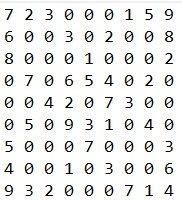
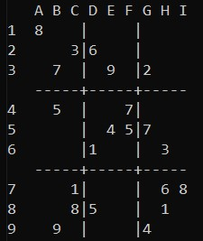
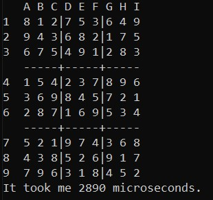

# Sudoku Solver

> Load a sudoku board from text files
> Try to solve them and
> Check your solution

## Images

> ### Input Board File Format
>
> 
>
> ### Display Board Hardest
>
> 
>
> ### Solved Board Hardest
>
> 
